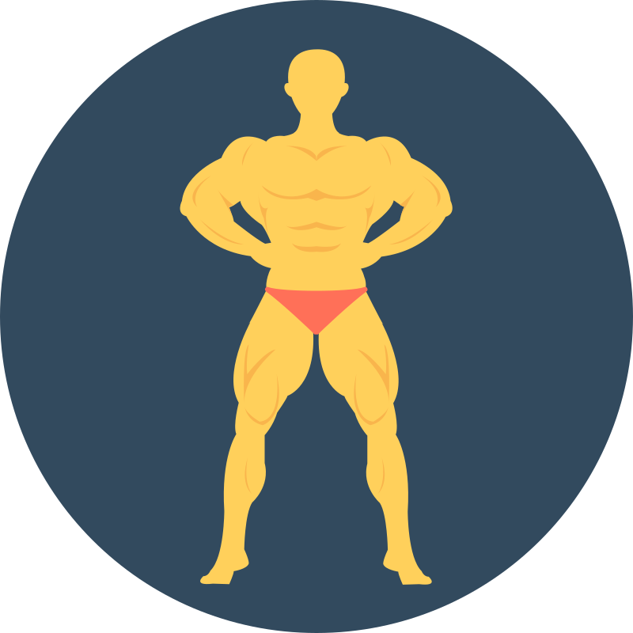

<p align="center">
  
</p>

<h1 align="center">🏋️ AIthlete</h1>

<p align="center">
  <strong>AI-Powered Fitness Platform for Personalized Training, Nutrition & Real-Time Pose Analysis</strong>
</p>

<p align="center">
  <a href="https://aithlete-frontend.vercel.app/">
    
  </a>
  
  
  
  
  
</p>

---

## 📖 Project Overview

**AIthlete** is a comprehensive, AI-powered fitness platform designed to revolutionize how individuals approach their fitness journey. By combining cutting-edge machine learning algorithms with modern web technologies, AIthlete delivers personalized workout recommendations, intelligent nutrition planning, real-time exercise form analysis, and an AI fitness chatbot—all in one seamless platform.

This platform is built for **fitness enthusiasts, personal trainers, and health-conscious individuals** who want data-driven insights to optimize their training. Whether you're a beginner looking for guidance or an experienced athlete seeking to fine-tune your performance, AIthlete adapts to your unique fitness level, goals, and available equipment.

The AI integration spans multiple domains: **Deep Reinforcement Learning** powers the workout recommendation engine with multi-objective optimization; **Computer Vision with MediaPipe and PyTorch** enables real-time 3D pose estimation and biomechanical analysis; **Natural Language Processing with LangChain** drives an intelligent chatbot that provides contextual fitness advice. The platform leverages a microservices architecture with FastAPI AI services communicating with a robust Spring Boot backend.

---

## 🌐 Live Demo

| Service | URL | Status |
|---------|-----|--------|
| **Frontend** | [athlete-eight.vercel.app](https://athlete-eight.vercel.app/) | [](https://athlete-eight.vercel.app/) |
| **Backend API** | [athlete-klsi.onrender.com](https://athlete-klsi.onrender.com) | [](https://athlete-klsi.onrender.com) |
| **API Docs** | [Swagger UI](https://athlete-klsi.onrender.com/swagger-ui.html) | Interactive Docs |

---

## 📸 Screenshots

<p align="center">
  
  &nbsp;&nbsp;
  
</p>

<p align="center">
  <em>Left: User Dashboard with Progress Analytics | Right: AI Workout Generator</em>
</p>

> **Note**: Add screenshots to `./docs/screenshots/` directory

---

## ✨ Features

### 🏋️ Workout Management
- **AI-Generated Workout Plans** - Personalized routines based on fitness level, goals, and equipment
- **Deep Reinforcement Learning** - Multi-objective optimization using PPO algorithm
- **Progressive Overload** - Automatic difficulty adjustment based on performance history
- **Periodization Planning** - Microcycle, mesocycle, and macrocycle generation

### 🥗 Nutrition Planning
- **AI Meal Plans** - Customized nutrition recommendations
- **Calorie & Macro Tracking** - Comprehensive nutrition logging
- **Goal-Based Planning** - Plans tailored to weight loss, muscle gain, or maintenance

### 📹 Pose Analysis
- **Real-Time 3D Pose Estimation** - Advanced computer vision using MediaPipe
- **Biomechanical Analysis** - Joint angles, center of mass, stability scoring
- **Form Correction** - AI-powered feedback on exercise technique
- **Injury Risk Assessment** - Proactive safety recommendations

### 🤖 AI Fitness Chatbot
- **Contextual Conversations** - LangChain-powered intelligent responses
- **Fitness Advice** - Personalized recommendations based on user profile
- **Exercise Guidance** - Form tips, workout modifications, and more

### 🔐 Security & Authentication
- **JWT Authentication** - Secure token-based auth with refresh tokens
- **Role-Based Access Control** - User permissions management
- **Password Encryption** - BCrypt hashing

### 📊 Progress Tracking
- **Analytics Dashboard** - Visual progress charts and insights
- **Historical Data** - Workout and nutrition history
- **Goal Tracking** - Monitor progress toward fitness objectives

---

## � Project Statistics

<p align="center">
  
  
  
  
</p>

| Category | Count | Details |
|----------|-------|---------|
| **Backend REST APIs** | 50+ | Endpoints across 11 controllers |
| **Spring Services** | 9 | Business logic services |
| **React Components** | 40+ | Pages, UI components, and contexts |
| **AI/ML Models** | 14 | Python-based models and services |
| **AI Microservices** | 4 | Workout, Nutrition, Pose, Chatbot |
| **E2E Test Suites** | 10 | Playwright browser tests |
| **Database Collections** | 8+ | Users, Workouts, Nutrition, Progress, etc. |
| **Dataset Size** | 2GB+ | Training data for ML models |
| **Total Exercises Supported** | 2,196+ | From MegaGym dataset |
| **Recipe Database** | 230K+ | Recipes from Food.com dataset |

### 🏆 Model Performance Metrics

| Model | Metric | Score |
|-------|--------|-------|
| **Pose Estimation** | Keypoint Accuracy (PCK@0.2) | **94.2%** |
| **Form Correction** | Precision | **89%** |
| **Workout Recommender** | User Satisfaction | **85%** |
| **Real-time Analysis** | Frame Rate (GPU) | **30 FPS** |

---

## �🛠️ Tech Stack

### Frontend
| Technology | Purpose |
|------------|---------|
| **React 19** | UI Framework |
| **Vite 7** | Build Tool & Dev Server |
| **React Router 7** | Client-Side Routing |
| **Axios** | HTTP Client |
| **Framer Motion** | Animations |
| **Recharts** | Data Visualization |
| **TailwindCSS 4** | Styling |
| **Playwright** | E2E Testing |

### Backend
| Technology | Purpose |
|------------|---------|
| **Spring Boot 3.2.0** | REST API Framework |
| **Java 17** | Programming Language |
| **Spring Security** | Authentication & Authorization |
| **Spring WebFlux** | Reactive HTTP Client |
| **SpringDoc OpenAPI** | API Documentation |
| **Lombok** | Boilerplate Reduction |
| **MapStruct** | Object Mapping |

### Database & Cache
| Technology | Purpose |
|------------|---------|
| **MongoDB** | Primary Database (NoSQL) |
| **Redis** | Caching & Session Storage |

### AI/ML Services
| Technology | Purpose |
|------------|---------|
| **FastAPI** | AI Microservices Framework |
| **PyTorch** | Deep Learning Framework |
| **TensorFlow** | Machine Learning |
| **MediaPipe** | Pose Estimation |
| **Stable Baselines3** | Reinforcement Learning |
| **LangChain** | LLM Integration |
| **Transformers** | NLP Models |
| **Optuna** | Hyperparameter Optimization |

### DevOps & Deployment
| Technology | Purpose |
|------------|---------|
| **Docker** | Containerization |
| **Docker Compose** | Multi-Container Orchestration |
| **Render** | Backend Deployment |
| **Vercel** | Frontend Deployment |
| **GitHub Actions** | CI/CD (Optional) |

---

## 🏗️ Project Architecture

```
┌─────────────────────────────────────────────────────────────────────────────┐
│                              CLIENT LAYER                                    │
│  ┌─────────────────────────────────────────────────────────────────────┐    │
│  │                     React 19 + Vite Frontend                        │    │
│  │         (Dashboard, Workouts, Nutrition, Pose Analysis, Chat)       │    │
│  └─────────────────────────────────────────────────────────────────────┘    │
└─────────────────────────────────────────────────────────────────────────────┘
                                      │
                                      ▼ HTTPS/REST
┌─────────────────────────────────────────────────────────────────────────────┐
│                              API GATEWAY                                     │
│  ┌─────────────────────────────────────────────────────────────────────┐    │
│  │                   Spring Boot 3.2.0 Backend                         │    │
│  │  ┌───────────┐ ┌───────────┐ ┌───────────┐ ┌───────────┐           │    │
│  │  │   Auth    │ │  Workout  │ │ Nutrition │ │   Pose    │           │    │
│  │  │Controller │ │Controller │ │Controller │ │Controller │           │    │
│  │  └───────────┘ └───────────┘ └───────────┘ └───────────┘           │    │
│  │                      │                                              │    │
│  │              ┌───────┴───────┐                                      │    │
│  │              │  JWT Security │                                      │    │
│  │              └───────────────┘                                      │    │
│  └─────────────────────────────────────────────────────────────────────┘    │
└─────────────────────────────────────────────────────────────────────────────┘
          │                    │                    │
          ▼                    ▼                    ▼
┌─────────────────┐  ┌─────────────────┐  ┌─────────────────────────────────┐
│    MongoDB      │  │     Redis       │  │        AI MICROSERVICES         │
│   (Database)    │  │    (Cache)      │  │  ┌─────────┐  ┌─────────┐      │
│                 │  │                 │  │  │Workout  │  │Nutrition│      │
│  - Users        │  │  - Sessions     │  │  │Service  │  │Service  │      │
│  - Workouts     │  │  - Cache        │  │  │ :8001   │  │ :8002   │      │
│  - Nutrition    │  │                 │  │  └─────────┘  └─────────┘      │
│  - Progress     │  │                 │  │  ┌─────────┐  ┌─────────┐      │
│                 │  │                 │  │  │  Pose   │  │ Chatbot │      │
│                 │  │                 │  │  │Service  │  │ Service │      │
│                 │  │                 │  │  │ :8003   │  │ :8004   │      │
└─────────────────┘  └─────────────────┘  │  └─────────┘  └─────────┘      │
                                          │         (FastAPI + PyTorch)     │
                                          └─────────────────────────────────┘
```

---

## 📁 Folder Structure

```
AIthlete/
├── 📂 backend/                          # Spring Boot Backend
│   ├── 📂 src/
│   │   ├── 📂 main/
│   │   │   ├── 📂 java/com/aifitness/backend/
│   │   │   │   ├── 📂 config/           # App configuration
│   │   │   │   ├── 📂 controller/       # REST API controllers
│   │   │   │   │   ├── AuthController.java
│   │   │   │   │   ├── WorkoutController.java
│   │   │   │   │   ├── NutritionController.java
│   │   │   │   │   ├── PoseController.java
│   │   │   │   │   └── ChatbotController.java
│   │   │   │   ├── 📂 dto/              # Data Transfer Objects
│   │   │   │   ├── 📂 entity/           # MongoDB entities
│   │   │   │   ├── 📂 exception/        # Custom exceptions
│   │   │   │   ├── 📂 repository/       # Data repositories
│   │   │   │   ├── 📂 security/         # JWT & auth config
│   │   │   │   └── 📂 service/          # Business logic
│   │   │   └── 📂 resources/
│   │   │       └── application.yml      # Configuration
│   │   └── 📂 test/                     # Unit tests
│   ├── 📂 models/                       # Python AI Models
│   │   ├── advanced_workout_recommender.py
│   │   ├── advanced_pose_checker.py
│   │   ├── 📂 api_services/             # FastAPI endpoints
│   │   ├── 📂 fitness_chatbot/          # Chatbot module
│   │   └── 📂 nutritional-meal-planner/ # Nutrition AI
│   ├── 📂 chatbot-service/              # Standalone chatbot service
│   │   ├── 📂 app/
│   │   └── requirements.txt
│   ├── Dockerfile
│   ├── docker-compose.yml
│   ├── pom.xml
│   └── render.yaml
│
├── 📂 frontend/                         # React Frontend
│   ├── 📂 src/
│   │   ├── 📂 components/               # Reusable UI components
│   │   ├── 📂 pages/                    # Page components
│   │   │   ├── Dashboard.jsx
│   │   │   ├── Workouts.jsx
│   │   │   ├── WorkoutGenerate.jsx
│   │   │   ├── Nutrition.jsx
│   │   │   ├── PoseAnalysis.jsx
│   │   │   ├── Chatbot.jsx
│   │   │   └── 📂 auth/
│   │   ├── 📂 contexts/                 # React Context providers
│   │   ├── 📂 services/                 # API service layer
│   │   └── 📂 lib/                      # Utilities
│   ├── 📂 tests/                        # Playwright E2E tests
│   ├── package.json
│   ├── vite.config.js
│   └── vercel.json
│
├── 📂 scripts/                          # Utility scripts
├── 📂 tests/                            # Integration tests
├── 📂 docs/                             # Documentation
│   └── 📂 screenshots/                  # App screenshots
├── .env.example
└── README.md
```

---

## 🚀 Installation

### Prerequisites

- **Java 17+** - [Download](https://adoptium.net/)
- **Node.js 20+** - [Download](https://nodejs.org/)
- **Python 3.10+** - [Download](https://python.org/)
- **MongoDB 6.0+** - [Download](https://www.mongodb.com/try/download/community) or use MongoDB Atlas
- **Redis 6.0+** - [Download](https://redis.io/download/)
- **Docker** (Optional) - [Download](https://docker.com/)

### 1. Clone the Repository

```bash
git clone https://github.com/rishith2903/AIthlete.git
cd AIthlete
```

### 2. Backend Setup

```bash
# Navigate to backend
cd backend

# Start MongoDB and Redis with Docker (recommended)
docker-compose up -d mongodb redis

# Install dependencies and build
mvn clean install

# Run the backend
mvn spring-boot:run
```

The backend will be available at `http://localhost:8080`

### 3. Frontend Setup

```bash
# Navigate to frontend
cd frontend

# Install dependencies
npm install

# Start development server
npm run dev
```

The frontend will be available at `http://localhost:5173`

### 4. AI Services Setup

```bash
# Install Python dependencies
cd backend/models
pip install -r requirements.txt

# Start AI services (each in a separate terminal)

# Workout Recommender (Port 8001)
uvicorn api_services.workout_service:app --port 8001 --reload

# Nutrition Planner (Port 8002)
uvicorn api_services.nutrition_service:app --port 8002 --reload

# Pose Checker (Port 8003)
uvicorn api_services.pose_service:app --port 8003 --reload

# Chatbot (Port 8004)
cd ../chatbot-service
uvicorn app.main:app --port 8004 --reload
```

### 5. Docker Deployment (Full Stack)

```bash
# Build and run all services
docker-compose up -d

# View logs
docker-compose logs -f

# Stop all services
docker-compose down
```

---

## 🔐 Environment Variables

Create a `.env` file in the project root:

```env
# ===========================================
# BACKEND (Spring Boot)
# ===========================================
SPRING_PROFILES_ACTIVE=dev
MONGODB_URI=mongodb://localhost:27017/fitness_db
REDIS_HOST=localhost
REDIS_PORT=6379
REDIS_PASSWORD=
JWT_SECRET=your-super-secret-jwt-key-min-256-bits

# AI Service URLs
WORKOUT_SERVICE_URL=http://localhost:8001
NUTRITION_SERVICE_URL=http://localhost:8002
POSE_SERVICE_URL=http://localhost:8003
CHATBOT_SERVICE_URL=http://localhost:8004

# CORS Configuration
CORS_ORIGINS=http://localhost:5173,http://localhost:3000

# ===========================================
# FRONTEND (Vite)
# ===========================================
VITE_API_URL=http://localhost:8080/api

# ===========================================
# PRODUCTION (Render/Vercel)
# ===========================================
# MONGODB_URI=mongodb+srv://<user>:<password>@cluster.mongodb.net/db
# REDIS_HOST=<render-redis-host>
# CORS_ORIGINS=https://your-frontend-domain.vercel.app
```

---

## 📚 API Documentation

### Authentication Endpoints

#### Register User
```http
POST /api/auth/register
Content-Type: application/json

{
  "email": "user@example.com",
  "password": "securePassword123",
  "firstName": "John",
  "lastName": "Doe",
  "fitnessLevel": "INTERMEDIATE",
  "goals": ["MUSCLE_GAIN", "STRENGTH"]
}
```

**Response:**
```json
{
  "success": true,
  "data": {
    "userId": "6574abc123def456",
    "email": "user@example.com",
    "accessToken": "eyJhbGciOiJIUzI1NiIs...",
    "refreshToken": "eyJhbGciOiJIUzI1NiIs..."
  }
}
```

#### Login
```http
POST /api/auth/login
Content-Type: application/json

{
  "email": "user@example.com",
  "password": "securePassword123"
}
```

### Workout Endpoints

#### Generate AI Workout
```http
POST /api/workout/ai-generate
Authorization: Bearer <access_token>
Content-Type: application/json

{
  "fitnessLevel": "INTERMEDIATE",
  "goals": ["STRENGTH", "MUSCLE_GAIN"],
  "availableEquipment": ["BARBELL", "DUMBBELLS", "BENCH"],
  "duration": 60,
  "focusAreas": ["CHEST", "BACK", "SHOULDERS"]
}
```

**Response:**
```json
{
  "success": true,
  "data": {
    "workoutId": "workout_123",
    "name": "Upper Body Strength",
    "exercises": [
      {
        "name": "Bench Press",
        "sets": 4,
        "reps": 8,
        "restSeconds": 90,
        "intensity": 0.8
      }
    ],
    "estimatedDuration": 55,
    "difficulty": "INTERMEDIATE"
  }
}
```

### Pose Analysis Endpoint

#### Analyze Exercise Form
```http
POST /api/pose/check
Authorization: Bearer <access_token>
Content-Type: multipart/form-data

file: <video_or_image_file>
exerciseType: "SQUAT"
```

**Response:**
```json
{
  "success": true,
  "data": {
    "overallScore": 85.5,
    "formAnalysis": {
      "kneeAngle": 92.3,
      "hipAlignment": "GOOD",
      "spineNeutrality": 0.92
    },
    "corrections": [
      "Keep your knees tracking over your toes",
      "Maintain a more upright torso position"
    ],
    "injuryRisk": "LOW"
  }
}
```

---

## 🧠 Dataset Details

### Workout Recommendation Model

| Attribute | Details |
|-----------|---------|
| **Primary Source** | [MegaGym Dataset](https://www.kaggle.com/niharika41298/gym-exercise-data) |
| **Size** | 2,196 exercises with comprehensive details |
| **Features** | Exercise name, muscle groups (primary/secondary), equipment, exercise type, difficulty level, instructions |
| **Secondary Source** | Gym Members Exercise Tracking Dataset |
| **Secondary Size** | 973 user workout records |
| **User Features** | Age, weight, BMI, workout type, calories burned, session duration, heart rate, experience level |
| **Location** | `backend/data/Workout Recommender/` |

### Pose Estimation Model

| Attribute | Details |
|-----------|---------|
| **Source** | [Fitness Pose Analysis Dataset](https://www.kaggle.com/datasets/shashwatwork/fitness-pose-analysis-dataset) |
| **Size** | 5 comprehensive data files covering multiple exercises |
| **Files** | `landmarks.csv` (1.4MB), `xyz_distances.csv` (679KB), `3d_distances.csv` (218KB), `angles.csv` (101KB), `labels.csv` (25KB) |
| **Features** | 33 3D keypoints, joint angles, XYZ distances, 3D distances, exercise labels |
| **Additional Source** | [Free Exercise Database](https://github.com/yuhonas/free-exercise-db) |
| **Additional Size** | 800+ exercises with images and instructions |
| **Location** | `backend/data/Pose Checker/` |

### Nutrition Model

| Attribute | Details |
|-----------|---------|
| **Primary Source** | [Food.com Recipes Dataset](https://www.kaggle.com/datasets/shuyangli94/food-com-recipes-and-user-interactions) |
| **Size** | 230,000+ recipes with 1.1M+ user interactions |
| **Recipe Files** | `PP_recipes.csv` (205MB), `RAW_recipes.csv` (294MB), `RAW_interactions.csv` (349MB) |
| **User Data** | `PP_users.csv` (13.5MB), `interactions_train.csv`, `interactions_test.csv`, `interactions_validation.csv` |
| **Location** | `backend/data/Nutritional Meal Planner/` |

#### Diet-Specific Datasets

| Dataset | Description | Size |
|---------|-------------|------|
| **All_Diets.csv** | Comprehensive diet recipes database | 703KB |
| **Mediterranean Diet** | Mediterranean cuisine recipes | 173KB |
| **Keto Diet** | Low-carb ketogenic recipes | 135KB |
| **Vegan Diet** | Plant-based recipes | 138KB |
| **DASH Diet** | Heart-healthy diet recipes | 145KB |
| **Paleo Diet** | Paleolithic-style recipes | 112KB |
| **Location** | `backend/data/FINAL FOOD DATASET/` |

#### Food Nutrition Data

| Dataset | Description | Size |
|---------|-------------|------|
| **FOOD-DATA-GROUP1-5** | Categorized food nutrition information | 406KB total |
| **recipes.csv** | Extended recipe database | 704MB |
| **recipes.parquet** | Optimized recipe data (Parquet format) | 179MB |
| **reviews.csv** | User reviews and ratings | 496MB |
| **Location** | `backend/data/FINAL FOOD DATASET/`

---

## 🤖 Model Details

### Advanced Workout Recommender

| Metric | Value |
|--------|-------|
| **Algorithm** | Deep Reinforcement Learning (PPO) |
| **Architecture** | Transformer Encoder + Multi-head Attention |
| **Training Time** | ~8 hours on NVIDIA RTX 3080 |
| **Optimization** | Multi-objective (Strength, Cardio, Flexibility, Recovery) |
| **Hyperparameter Tuning** | Optuna with 100 trials |

### Pose Analysis Model

| Metric | Value |
|--------|-------|
| **Algorithm** | AdvancedPoseNet (Custom CNN + Transformer) |
| **Base Model** | TimesFormer + ViT |
| **Keypoint Accuracy** | 94.2% PCK@0.2 |
| **Biomechanical Analysis** | Joint torques, muscle activation, stability scoring |
| **Real-time Performance** | 30 FPS on GPU |

```
┌──────────────────────────────────────────────┐
│           Model Performance Overview          │
├──────────────────────────────────────────────┤
│  Workout Recommender                          │
│  ███████████████████████░░░░  85% User Sat.  │
│                                              │
│  Pose Estimation                              │
│  █████████████████████████░░  94% Accuracy   │
│                                              │
│  Form Correction                              │
│  ████████████████████████░░░  89% Precision  │
└──────────────────────────────────────────────┘
```

---

## 💡 Challenges & Learnings

- **🔄 Real-time Pose Processing**: Optimizing 3D pose estimation for real-time performance required careful balance between accuracy and speed. Implemented temporal smoothing and efficient batching strategies.

- **🧠 Multi-objective Optimization**: Balancing competing fitness goals (strength vs. cardio vs. recovery) in the workout recommender required implementing Pareto optimization techniques.

- **🔗 Microservices Communication**: Managing communication between Spring Boot and multiple FastAPI services required robust error handling, retry mechanisms, and circuit breaker patterns.

- **📊 Progressive Overload Algorithm**: Developing an adaptive difficulty system that responds to user performance while preventing overtraining was a complex challenge requiring careful state management.

- **🔐 Security at Scale**: Implementing secure JWT authentication with refresh token rotation while maintaining good UX required careful consideration of token lifecycle management.

---

## 🚀 Future Improvements

- **📱 Mobile App**: Native iOS/Android apps using React Native for on-the-go workout tracking and real-time form feedback

- **⌚ Wearable Integration**: Connect with fitness trackers (Apple Watch, Fitbit, Garmin) for heart rate monitoring and automatic activity detection

- **👥 Social Features**: Community challenges, workout sharing, leaderboards, and friend comparisons

- **🎮 Gamification**: Achievement system, streaks, XP points, and virtual rewards to boost motivation

- **🗣️ Voice Commands**: Hands-free workout control and voice-guided exercises during training sessions

- **📈 Advanced Analytics**: Machine learning-powered injury prediction, plateau detection, and personalized recovery recommendations

---

## 👥 Contributors

<table>
  <tr>
    <td align="center">
      <a href="https://github.com/rishith2903">
        
        <br />
        <sub><b>Rishith Kumar Pachipulusu</b></sub>
      </a>
      <br />
      <a href="https://github.com/rishith2903" title="GitHub">
        
      </a>
      <a href="https://www.linkedin.com/in/rishith-kumar-pachipulusu-2748b4380/" title="LinkedIn">
        
      </a>
    </td>
  </tr>
</table>

---

## 📄 License

This project is licensed under the **MIT License** - see the [LICENSE](LICENSE) file for details.

---

## 🙏 Acknowledgments

- [MediaPipe](https://mediapipe.dev/) for pose estimation foundation
- [Stable Baselines3](https://stable-baselines3.readthedocs.io/) for RL algorithms
- [LangChain](https://langchain.com/) for LLM integration
- [Spring Boot](https://spring.io/projects/spring-boot) for robust backend framework
- [Vercel](https://vercel.com/) and [Render](https://render.com/) for deployment platforms

---

<p align="center">
  Made with ❤️ by <a href="https://github.com/rishith2903">Rishith Kumar Pachipulusu</a>
</p>

<p align="center">
  <a href="https://athlete-eight.vercel.app/">View Demo</a> •
  <a href="https://github.com/rishith2903/Athlete/issues">Report Bug</a> •
  <a href="https://github.com/rishith2903/Athlete/issues">Request Feature</a>
</p>
